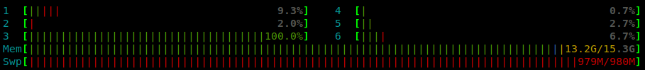

# Stress

A simple app to generate `CPU` and `memory` stress



## Requirements

- Ruby
- Sinatra


## Running locally

```bash
gem install sinatra rackup
ruby app.rb
```

## Running using docker

```bash
docker run -it -p 4567:4567 robertvilvert/stress:1.0
```

## Routes

```
/cpu
/memory
```

## Params

* s: stress duration in seconds


## Usage

```bash
curl http://localhost:4567/memory?s=10

curl http://localhost:4567/cpu?s=4
```
